# Student Dashboard Project

The purpose of this project is to create a clean and dynamic student dashboard application. The application will use the data provided in a JSON file, and users will have options to change the display, look for a student or students, see more info about a specific student, and also edit some of their info along with being able to add notes. 

## Link

[Student Dashboard App](https://student-dashboard-mq.netlify.app/)

## Features

#### Global Features

- Dark Mode Toogle Button
- Desktop and mobile displays are different

#### Home Page Features

- Filter Students by Cohort
   - Current Cohort List's Title will change according to choice (All Cohorts by default)
      - Winter, Fall, Summer, Spring (2026)
      - Winter, Fall, Summer, Spring (2025)
- Filter Students by Track Status
   - On Track (Resume, LinkedIn, GitHub, Mock Interview, Codewars score greater than 600)
   - Off Track
- Sort Students 
   - By Codewars scores (Lowest to Highest or vice versa)
   - By Name (A - Z or vice versa)
- Search Student/s by Name (Matches will change as users type).
- Total Students count will change according to how many students meet the criteria set by the users.
- Users are able to change how they see the students on the page
   - Card Display
      - Picture, name, and email shown
         - Picture's border color changes according to track status. (Green - On Track, Red - Off Track)
         - Email is clickable for easy copy to users clipboard.
         - Profile Page link shown at the bottom of the card, so users can click on it and go that specific student's profile page.
   - Picture Display
      - Only picture is shown, and picture is clickable, this way users are also able to go to that specific student's profile page.
      - Picture's border color changes according to track status. (Green - On Track, Red - Off Track)
   - Name Display
      - Only name is shown as a button, this way users are also able to go to that specific student's profile page.
      - Buttons's background color changes according to track status. (Green - On Track, Red - Off Track)

#### Profile Page Features

- Home button so users are able to click back home.
- Picture's border color changes according to track status. (Green - On Track, Red - Off Track)
- Edit button next to student's name
   - Form appears, allowing users to change a specific student's certications status, and class scores. (not to be confuse with Codewars scores)
- Once again, email is clickable for easy copy to users clipboard.
- Form to add notes to a specific student's 1 on 1 notes list, said list appears next to this form.
   - Each note can be deleted with a click on the red button right next to it.
- Percentages changes text color according to grade. (Green - 90% and higher, Yellow - 80% to 89%, Orange - 70% to 79%, Red - 69% and Lower)
- Certifications status will change according to status. (Face and Check Mark - Done, Face and X - Needs to be Done)

## Examples

#### Home Page (Light)

- Card Display

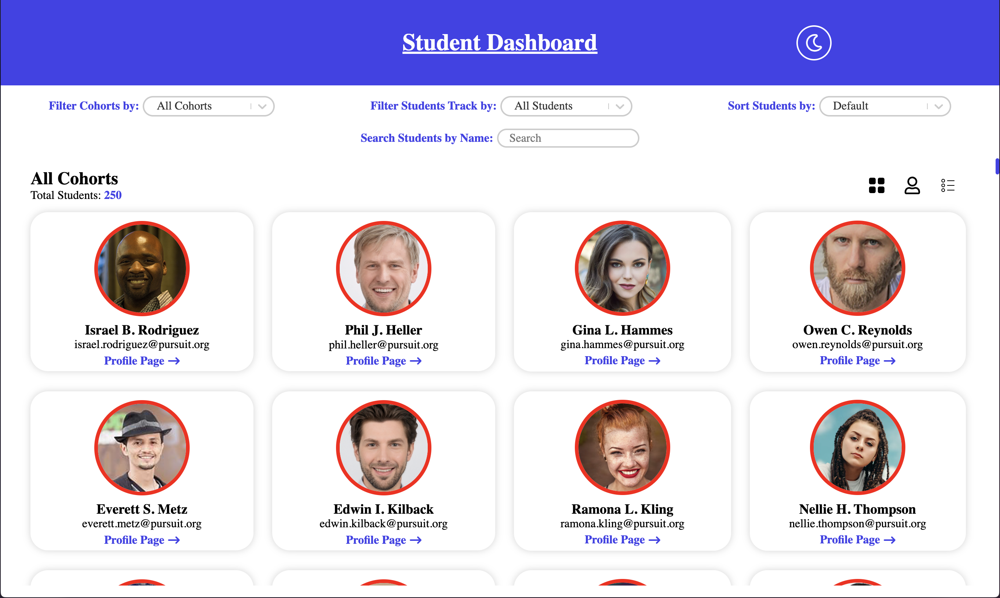

- Picture Display

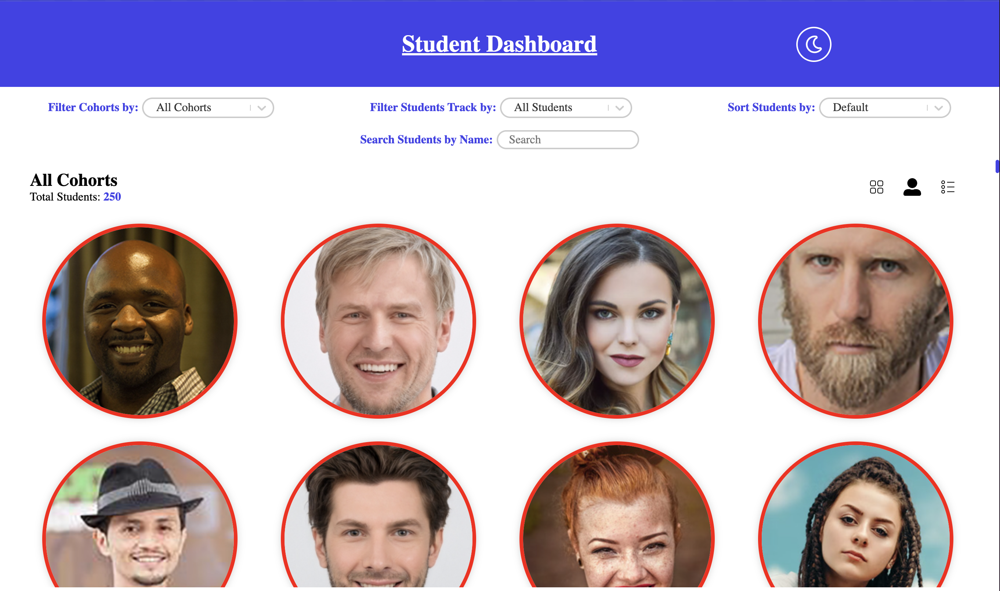

- Name Display

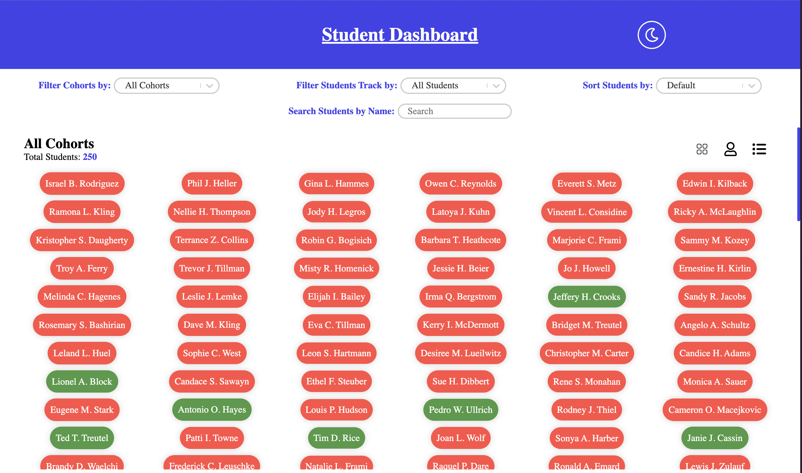

#### Home Page (Dark)

- Card Display

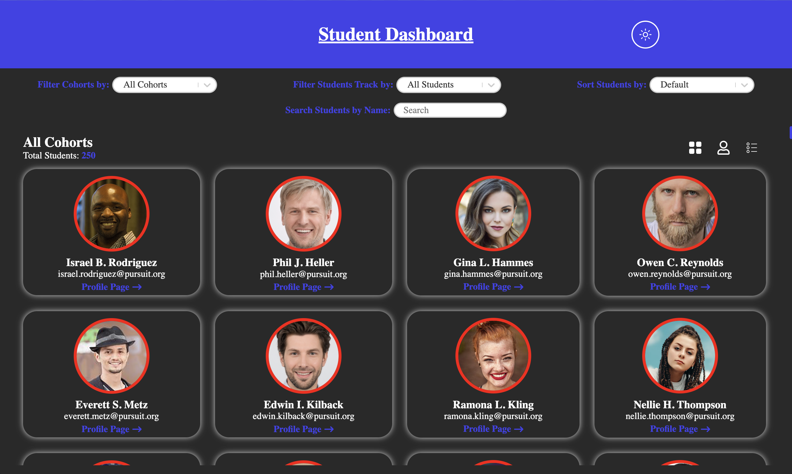

- Picture Display

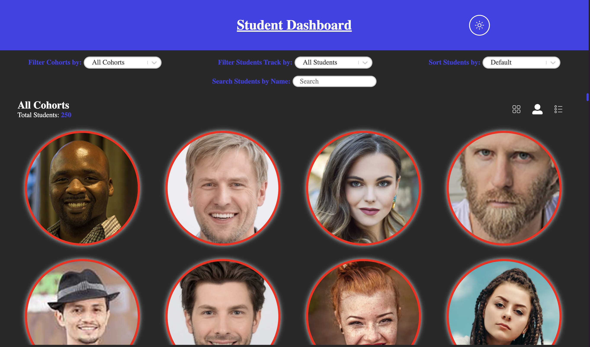

- Name Display

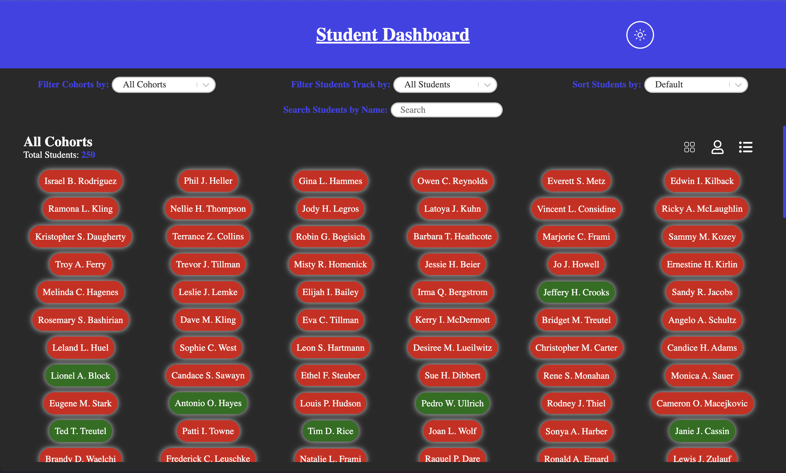

#### Profile Page (Light)

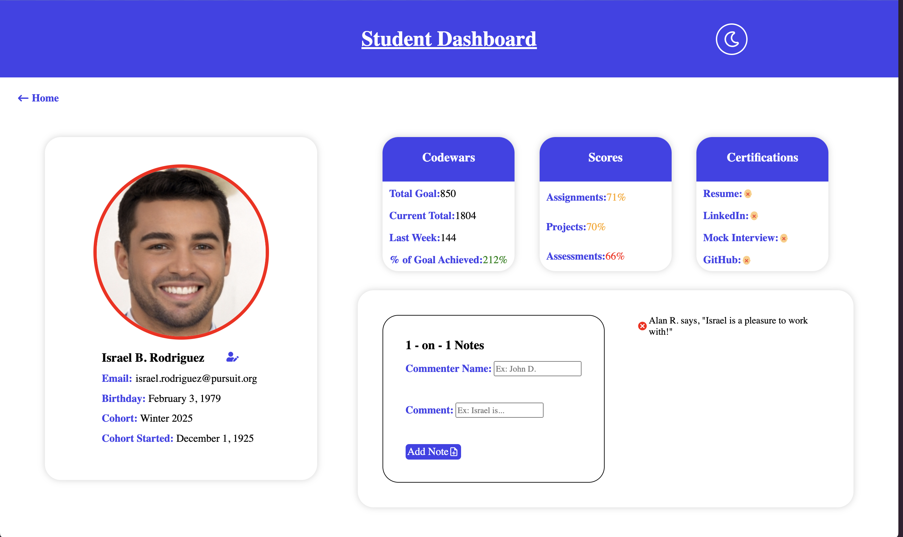

#### Profile Page (Dark)

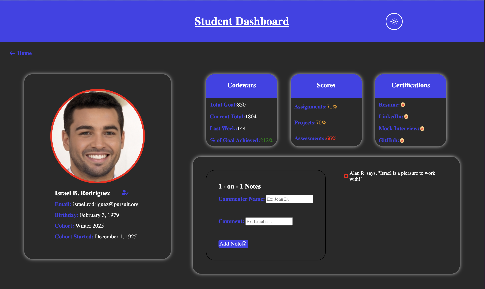

#### Profile Page Edit Form 

- Light

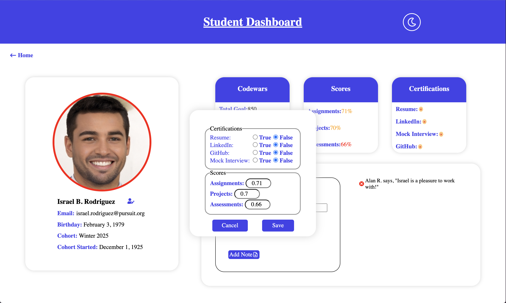

- Dark

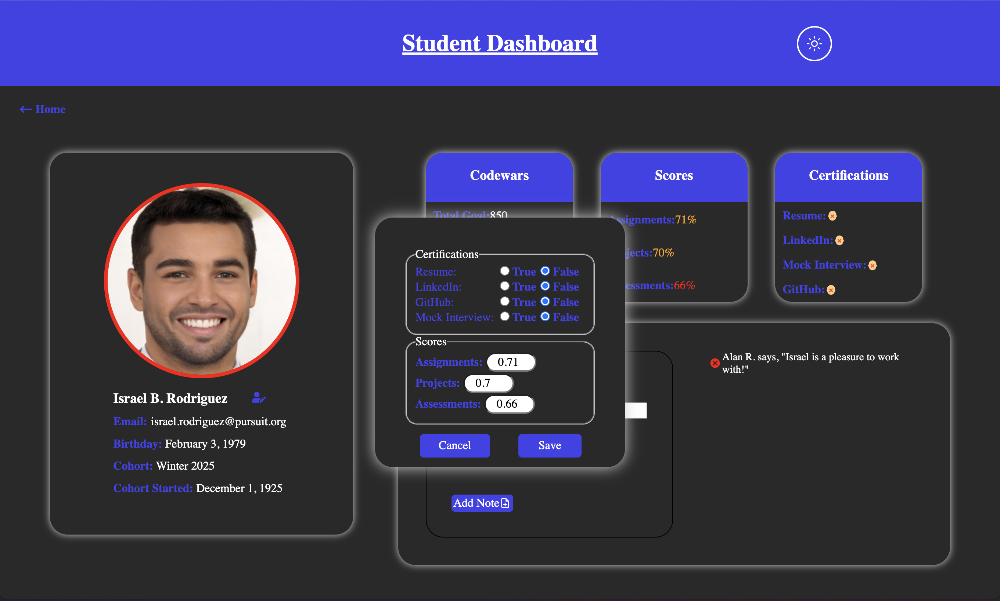

#### Some Examples of Mobile View

- Home Page 

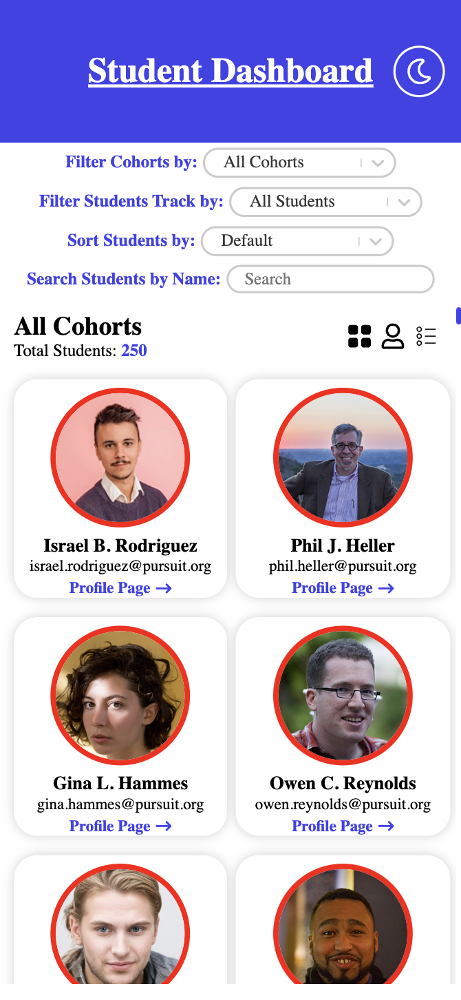

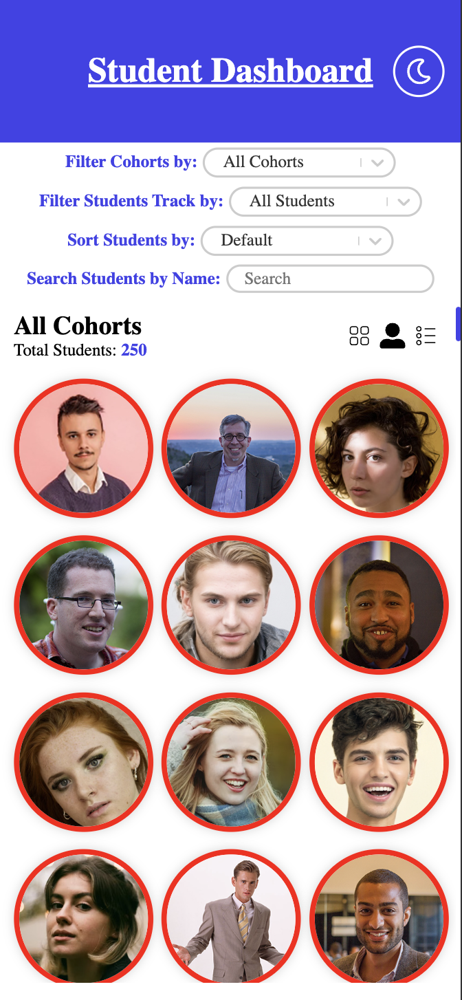

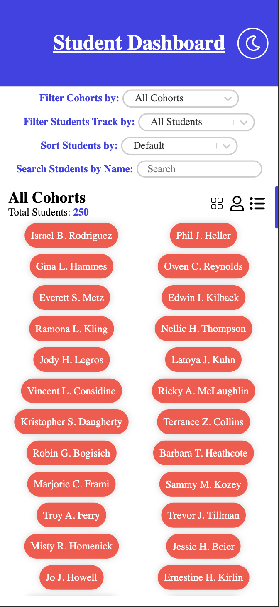

- Profile Page

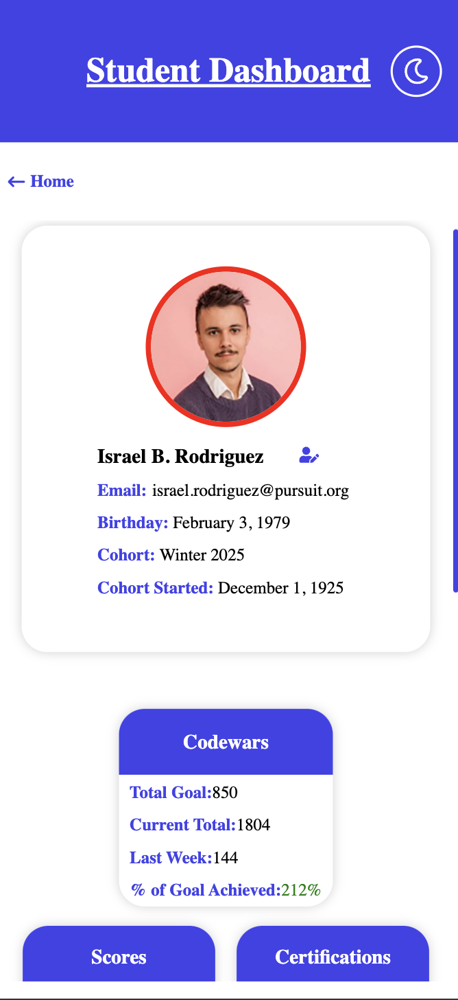

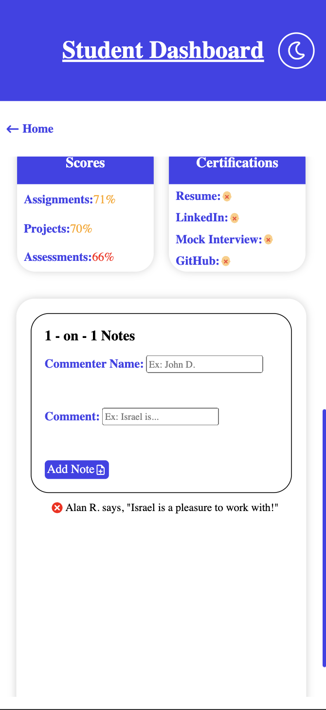
